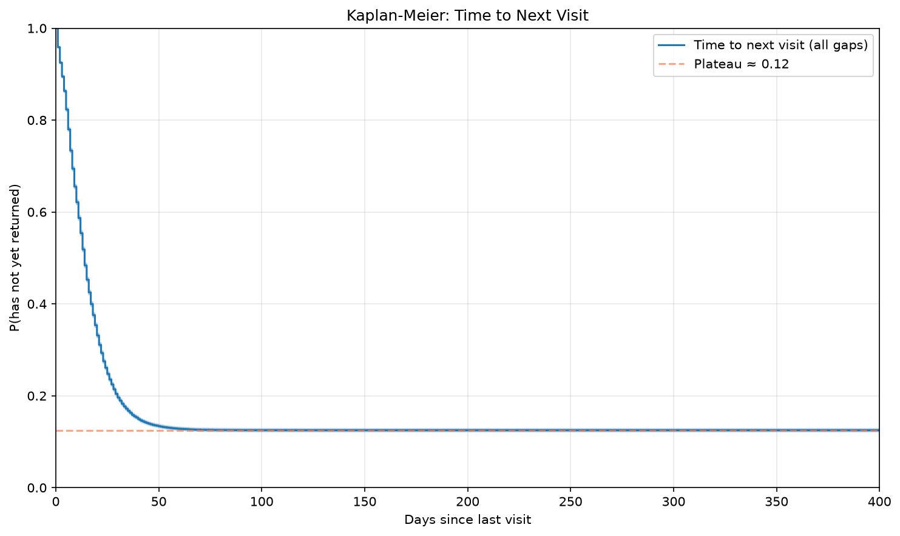
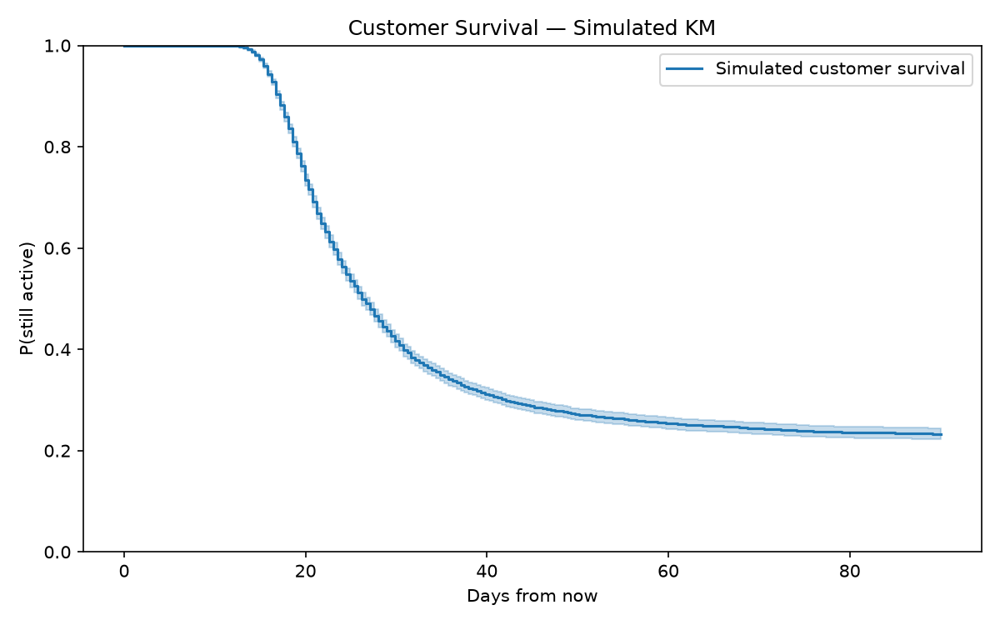
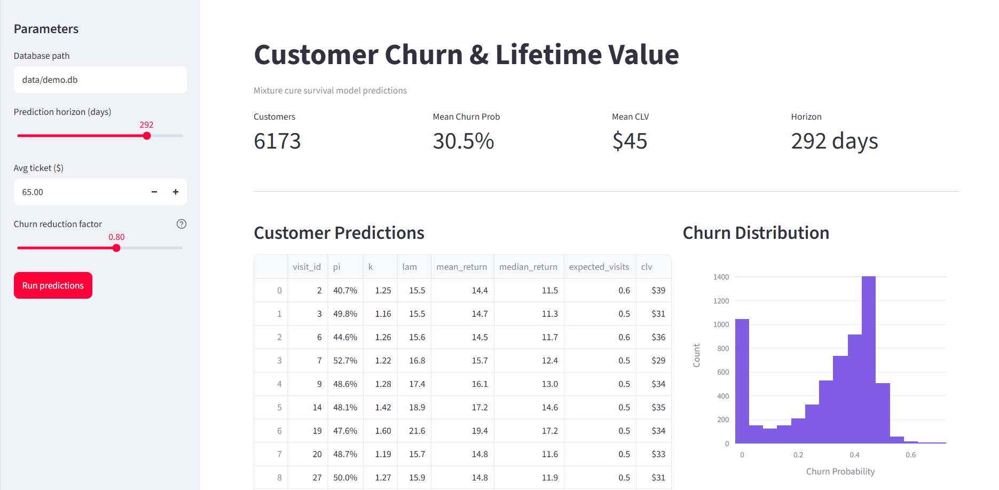

# csurv — A Mixture Cure Survival Model for Customer Retention

A restaurant owner watches customers come and go, week after week.  Many visit only once, but some return again and again.  After a regular doesn't return for several weeks, the owner wonders if she should worry - what happened on their last visit?  From the service floor, it's hard to see patterns in guest loyalty - coincidences look like patterns and real trends are often invisible.  

One approach to answering questions about the time until an event comes from the world of clinical trials.  Used across indications, but especially in oncology, **survival analysis** is a family of approaches to answering questions about *time-to-event* data, especially *censored data*, where the outcome of some observations is unknown.  

In this repo, we explore both a classical survival analysis approach and, in response to its flaws in the restaurant context, explore an alternative approach.  

## Ideas from Oncology
Imagine you are running a small trial - 10 patients being treated for a rare disease receive a drug designed to prevent a common complication.  Two patients have the complication soon after being treated - say, after two days.  Two more patients have it eventually, but the treatment works for longer, say after two weeks.   Of the remaining six, two left the study early for unknown reasons, and four don't have the complication for the duration of the study.  How could you describe for how long we can expect patients taking this drug to avoid the complication? If we only average the times to occurrence for the patients who had the complication, we'd be wildly underestimating the drug's effectiveness.  But for six of the subjects, we don't know for how long the treatment will work.  We say that the time-to-event data for these subjects is *censored*.

Our restaurant owner wants to know how long it takes for guests to return, so she knows when to follow-up with a regular who hasn't come back in a while.  Applying the standard oncology approach to restaurant data, we obtain a *Kaplan-Meier* estimate of the survival function (the complement of the CDF of the time-to-return random variable).  At first glance, this curve seems to suggest that 12% of customers never return.  



However, the curve is potentially misleading.  The standard approach used in oncology isn't built for an event that can occur repeatedly and under reasonable assumptions, this asymptote shows the reciprocal of the average number of visits per customer.    

To see if this asymptote is trustworthy as an estimate of attrition rate, consider a simpler set-up: customers flip a (possibly biased) coin after each visit to decide whether or not to return.  In this scenario, the proportion of customers who fail to return after any given visit would indeed be equal to the reciprocal of the expected value of the number of visits per customer.  This example elides an important reality of restaurants: first-time visitors could be easily turned off by a mediocre experience, while regulars may be forgiving of a bad experience.  Indeed, the overall churn rate is, frankly, uninformative!  Attrition on later visits is likely attributable to an unavoidable base-rate (customers moving away, or otherwise changing circumstances) or rare service catastrophes (which the owner would be aware of anyway, and which would be better detected by estimates of time to return).  The rate of first-visit churn is more important, and this plot does not estimate it.

We want an approach to the problem that explicitly models the dynamics of repeat return customers and this underlying probability that a customer may never return.

## The Data

To explore our alternate model, we generate synthetic data by simulating a real restaurant.  Each customer is generated individually, assigned traits drawn from appropriate distributions (mostly beta distributions), and then the impact of those traits on likelihood of return are also drawn from beta distributions.  

At each visit, customers' likelihood to churn remembers (partially) their likelihood at the previous visit: intuitively, their attitude towards the restaurant - at the previous visit and adjusts based on their experience at the current visit (modeled using more beta distributions and random selections of dishes ordered and other visit characteristics)

The generated data look plausible on first glance.  In particular the time between visits does look Weibull-shaped.  One issue, which could be improved by tuning the parameters in data generation, is that the weekly visit volume doesn't stabilize over the course of data collection, and that it doesn't exhibit obvious seasonal variation.


## The Model
The model we implement is [discussed further in the mathematical writeup](docs/cure_model.md).  In brief summary, we use a parametric mixture-cure model.  The advantage of a parametric model is that it gives us parameters we can train.  Using a Weibull distribution gives us a flexible hazard ratio, so we can account for a wide variety of return dynamics.

The parameters are optimized using an EM algorithm with L-BFGS-B optimization on the M step.

The model learns linear maps from normalized feature vectors (describing the characteristics of a particular customer and visit) to parameter space.  We then use the parameters (the images of these linear maps on the characteristics of each individual censored visit) to the return behavior relating to censored records.

One note: a common survival analysis tool, lifelines, does provide a mixture cure fitter.  However it does not support covariates — this project allows more flexibility and allows us to distinguish the impact of covariates on the model parameters. 

## Results

In the original simulation, we saved the "true" event/non-event distinction (not visible in the synthetic data fed to the model) for model validation.  The shape and scale parameters specified in the synthetic data were also closely predicted:

| $k$ | $\widehat{k}$ |
|------|-----------|
|$1.5$ | $1.36$ |

| $\lambda$ | $\widehat{\lambda}$ |
|------|-----------|
|$14$ | $12.2$ |

The covariate coefficients for these parameters were small - an artifact more of the way our data were generated than of any essential feature of the model.

The the true churn rate on each customer's final visit exactly matches the predicted churn rate - but this also matches the plateau of the KM plot.  As discussed, this isn't particularly meaningful:

| $\pi_{\text{churn}}$ | $\widehat{\pi}_{\text{churn}}$ |
|------|-----------|
|$12.2\%$ | $12.2\%$ |


Indeed, the model learned a coefficient for `gap_num` (β = −6.25, r = −0.35), the variable which encoded visit number, which provided accurate predictions of per-visit attrition. 

| Visit | $\pi_{\text{churn}}$ | $\widehat{\pi}_{\text{churn}}$ |
|------:|---------------------:|-------------------------------:|
| 1     | $44.8\%$             | $44.1\%$                       |
| 2     | $40.0\%$             | $33.1\%$                       |
| 3     | $22.1\%$             | $23.8\%$                       |
| 4     | $10.7\%$             | $16.3\%$                       |
| 5     | $7.3\%$              | $10.9\%$                       |
| 6     | $4.0\%$              | $7.2\%$                        |
| 7     | $3.5\%$              | $4.6\%$                        |
| 8     | $1.6\%$              | $3.0\%$                        |
| 9     | $1.6\%$              | $1.9\%$                        |
| 10    | $1.2\%$              | $1.2\%$                        |


Of 17 covariates with non-negligible impact on churn rate, the model predicted influence on churn correctly (with correct sign) for $15$ of them.

Estimated parameters were also used to simulate customer outcomes for the censored records.  From the plot, it seems tha approximately 20% of customers become regulars.



This graph is, in some sense, dual to the plot shown earlier - it shows the proportion of customers who are still active after some interval, with no concern for return.  

To quickly explore the impact of reducing the churn factor on customer lifetime value, you can run our streamlit app in docker:



## Further Directions
One question a restaurant might reasonably ask is: are any dishes associated with an increased or decreased likelihood of attrition?  In our current approach, we have embedded tickets by the proportion of each course (appetizer, entree, dessert) ordered by a particular party.

A more sophisticated approach would be to perform principal component analysis via singular value decomposition.  For those unfamiliar, here is an intuitive picture of the technique that I like: Consider the bipartite graph with dishes on one side and visits on the other, where edges connect a visit to each dish ordered (with multiplicity for repeated items).  Let $M$ be the visits-by-dishes matrix encoding this graph.  Then $M^T M$ counts the number of length-2 paths between each pair of dishes; that is, the number of visits at which both dishes were ordered (again, with multiplicity).  This is the adjacency matrix of a graph showing the frequency with which dishes are ordered together.  If this graph were disconnected, a fully connected component in this graph (a set of dishes that always appear together) would correspond to an eigenspace of $M^T M$.  An isolated dish would correspond to an eigenvector with eigenvalue equal to the sum of the squares of the number of instances of that dish over all orders.  In real data connected components are unlikely and groupings of dishes are approximate, but the largest members of the spectrum of $M^T M$ still indicate clusters of dishes.  By projecting each visit's order into a lower dimensional space spanned by these principal components, we could test whether particular dish clusters are associated with higher or lower attrition.

## Usage

### Quick start
```bash
docker compose up
# API: localhost:8000/docs
# Dashboard: localhost:8501
```
### CLI
```python
uv run csurv demo              # generate + train + predict
uv run csurv predict --db ...  # score customers
```
### API endpoints
| Endpoint | Method | Description |
|---------|------|----------|
| /health | GET | Status check |
| /predict | POST | Customer predictions |
| /uplift | POST | CLV uplift analysis |
| /survival | POST | Survival curve |

## Testing
```python
uv run pytest
```
## License
MIT